# AI Playground - System Architecture

## Overview
This is a full-stack MERN application with AI integration for code generation and playground functionality.

## Architecture Diagram

```mermaid
graph TB
    %% User Layer
    U[👤 User] --> FE[🌐 Frontend - Next.js 15]
    
    %% Frontend Layer
    FE --> |"HTTP/HTTPS Requests"| BE[🚀 Backend - Express.js]
    FE --> |"API Calls"| GEMINI[🤖 Google Gemini 2.0 Flash API]
    
    %% Authentication & State Management
    FE --> |"State Management"| ZUSTAND[📦 Zustand Store]
    ZUSTAND --> |"Auth State"| AUTH_STORE[🔐 Auth Store]
    ZUSTAND --> |"Playground State"| PLAY_STORE[🎮 Playground Store]
    
    %% Backend Layer
    BE --> |"Authentication"| JWT[🔑 JWT Middleware]
    BE --> |"Data Persistence"| DB[🍃 MongoDB Atlas]
    BE --> |"Rate Limiting"| RATE[⏱️ Rate Limiter]
    
    %% Database Collections
    DB --> |"Collections"| COLLECTIONS{📂 Collections}
    COLLECTIONS --> USERS[👥 Users]
    COLLECTIONS --> SESSIONS[📝 Playground Sessions]
    
    %% External Services
    GEMINI --> |"AI Responses"| FE
    
    %% Deployment
    FE --> |"Deployed on"| VERCEL_FE[▲ Vercel Frontend]
    BE --> |"Deployed on"| VERCEL_BE[▲ Vercel Backend]
    
    %% Styling & UI
    FE --> |"Styling"| TAILWIND[🎨 Tailwind CSS v4]
    FE --> |"Icons"| LUCIDE[✨ Lucide React]
    FE --> |"Animations"| FRAMER[🎭 Framer Motion]
    
    %% Code Editor
    FE --> |"Code Editing"| EDITOR[📝 Code Editor Component]
    FE --> |"Syntax Highlighting"| SYNTAX[🌈 React Syntax Highlighter]
    
    classDef frontend fill:#61dafb,stroke:#21759b,stroke-width:2px,color:#000
    classDef backend fill:#68a063,stroke:#3e6d35,stroke-width:2px,color:#fff
    classDef database fill:#4db33d,stroke:#2d6e1e,stroke-width:2px,color:#fff
    classDef external fill:#ff6b6b,stroke:#e55a5a,stroke-width:2px,color:#fff
    classDef deployment fill:#000,stroke:#333,stroke-width:2px,color:#fff
    
    class FE,ZUSTAND,AUTH_STORE,PLAY_STORE,TAILWIND,LUCIDE,FRAMER,EDITOR,SYNTAX frontend
    class BE,JWT,RATE backend
    class DB,COLLECTIONS,USERS,SESSIONS database
    class GEMINI external
    class VERCEL_FE,VERCEL_BE deployment
```



## Technology Stack

### Frontend (Next.js 15.4.3)
- **Framework**: Next.js 15 with Turbopack
- **Language**: TypeScript
- **Styling**: Tailwind CSS v4
- **State Management**: Zustand v5
- **UI Components**: 
  - Lucide React (Icons)
  - Framer Motion (Animations)
  - React Syntax Highlighter
- **Authentication**: Custom JWT implementation
- **AI Integration**: Google Generative AI SDK v0.24.1

### Backend (Node.js + Express)
- **Runtime**: Node.js
- **Framework**: Express.js v4.18.2
- **Database**: MongoDB with Mongoose v8.0.3
- **Authentication**: JWT (jsonwebtoken v9.0.2)
- **Security**: 
  - bcryptjs v2.4.3 (Password hashing)
  - CORS v2.8.5
  - Express Rate Limit v7.1.5
- **Validation**: Express Validator v7.0.1
- **Environment**: dotenv v16.3.1

### Database (MongoDB Atlas)
- **Type**: NoSQL Document Database
- **Hosting**: MongoDB Atlas (Cloud)
- **Collections**:
  - Users (Authentication & Profile)
  - Playground Sessions (Code & Projects)

### External APIs
- **AI Service**: Google Gemini 2.0 Flash API
- **Purpose**: Code generation and AI chat functionality

## Data Flow

### 1. Authentication Flow
```
User → Frontend → Backend → MongoDB → JWT Token → Frontend State
```

### 2. Code Generation Flow
```
User Input → Frontend → Gemini API → AI Response → Frontend Display
```

### 3. Playground Session Flow
```
User Code → Frontend → Backend → MongoDB → Session Saved
```

## Security Features

1. **JWT Authentication**: Secure token-based authentication
2. **Password Hashing**: bcryptjs for secure password storage
3. **Rate Limiting**: Protection against API abuse
4. **CORS Configuration**: Controlled cross-origin requests
5. **Input Validation**: Express Validator for request validation
6. **Environment Variables**: Secure configuration management

## API Endpoints

### Authentication Routes (`/api/auth`)
- `POST /register` - User registration
- `POST /login` - User login
- `POST /refresh` - Token refresh
- `POST /logout` - User logout

### User Routes (`/api/user`)
- `GET /profile` - Get user profile
- `PUT /profile` - Update user profile
- `PUT /password` - Change password
- `DELETE /account` - Delete account

### Playground Routes (`/api/playground`)
- `GET /sessions` - Get user sessions
- `GET /sessions/:id` - Get specific session
- `POST /sessions` - Create new session
- `PUT /sessions/:id` - Update session
- `DELETE /sessions/:id` - Delete session
- `POST /sessions/:id/messages` - Add chat message

## Environment Configuration

### Frontend (.env)
```env
NEXT_PUBLIC_GEMINI_API_KEY=your_gemini_api_key
NEXT_PUBLIC_API_URL=https://acciojob-b.vercel.app/api
```

### Backend (.env)
```env
MONGODB_URI=mongodb+srv://...
JWT_SECRET=your_jwt_secret
JWT_EXPIRE=7d
PORT=8001
NODE_ENV=production
FRONTEND_URL=https://your-frontend-domain.vercel.app
```

## Deployment Architecture

### Frontend Deployment (Vercel)
- **Platform**: Vercel
- **Build**: Next.js static generation
- **Environment**: Production optimized
- **CDN**: Global edge network

### Backend Deployment (Vercel)
- **Platform**: Vercel Serverless Functions
- **Runtime**: Node.js
- **Database**: MongoDB Atlas (External)
- **Environment**: Serverless architecture

## Key Features

1. **AI-Powered Code Generation**: Integration with Gemini 2.0 Flash
2. **Real-time Code Editor**: Syntax highlighting and validation
3. **Session Management**: Save and restore coding sessions
4. **User Authentication**: Secure user accounts
5. **Responsive Design**: Mobile-first approach
6. **Type Safety**: Full TypeScript implementation
7. **Modern UI**: Tailwind CSS with animations

## Performance Optimizations

1. **Static Generation**: Next.js static optimization
2. **Code Splitting**: Automatic bundle splitting
3. **Rate Limiting**: API protection
4. **Caching**: Browser and CDN caching
5. **Compression**: Gzip compression
6. **Lazy Loading**: Component lazy loading

## Monitoring & Logging

1. **Error Handling**: Comprehensive error boundaries
2. **API Logging**: Request/response logging
3. **Performance Monitoring**: Vercel analytics
4. **Security Monitoring**: Rate limit tracking

This architecture provides a scalable, secure, and maintainable foundation for the AI Playground application.
